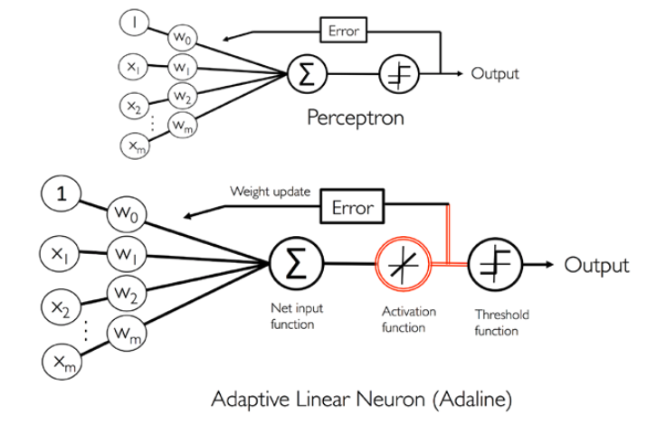
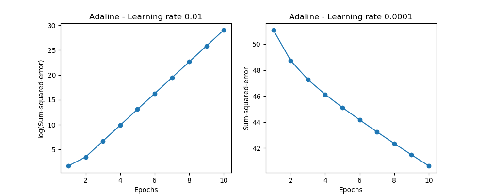

# ADAptive LInear NEuron (Adaline)
### Adaptive linear neurons and the convergence of learning

The key difference between the Adaline rule and Rosenblatt's perceptron is that the weights are updated based on a linear activation function rather than a unit step function like in the perceptron.

While the linear activation function is used for learning the weights, we still use a threshold function to make the final prediction.

The main advantage of this continuous linear activation function, in contrast to the unit step function, is that the cost function becomes differentiable

Another nice property of this cost function is that it is convex -> gradient descent to find the weights that minimize our cost function.

The left chart shows what could happen if choose a learning rate that is too large. 
Instead of minimizing the cost function, the error becomes larger in every epoch, because overshoot the global minimum. 
On the other hand, we can see that the cost decreases on the right plot, but the chosen learning rate, 𝜂𝜂 = 0.0001, 
is so small that the algorithm would require a very large number of epochs to converge to the global cost minimum.

One of the reasons why standardization helps with gradient descent 
learning is that the optimizer has to go through fewer 
steps to find a good or optimal solution (the global cost minimum)

