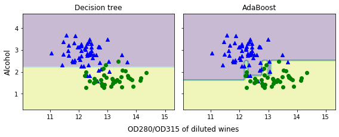

# Learning with ensembles

The goal of ensemble methods is to combine different classifiers into a meta-classifier that has better 
generalization performance than each individual classifier alone. 

For example, assuming that we collected predictions from 10 experts, 
ensemble methods would allow us to strategically combine those predictions 
by the 10 experts to come up with a prediction that was more accurate and robust than 
the predictions by each individual expert.

## majority voting principle

select the class label that has been predicted by 
the majority of classifiers, that is, received more than 50 percent of the votes

Using the training dataset, we start by training m different classifiers (C1, ... , Cm). 
Depending on the technique, the ensemble can be built from different classification algorithms, 
for example, decision trees, support vector machines, logistic regression classifiers, and so on. 

### Train three different classifiers:
- Logistic regression classifier
- Decision tree classifier
- k-nearest neighbors classifier

Evaluate the model performance of each classifier via 10-fold cross-validation on the training dataset before 
combining them into an ensemble classifier

10-fold cross validation:

ROC AUC: 0.87 (+/- 0.17) [Logistic regression]

ROC AUC: 0.89 (+/- 0.16) [Decision tree]

ROC AUC: 0.88 (+/- 0.15) [KNN]

ROC AUC: 0.94 (+/- 0.13) [Majority voting]

Interestingly, but also as expected, the decision regions of the ensemble classifier seem to be a hybrid of 
the decision regions from the individual classifiers. At first glance, the majority vote decision boundary 
looks a lot like the decision of the decision tree stump, which is orthogonal to the y axis for sepal width ≥ 1. However, 
you can also notice the non-linearity from the k-nearest neighbor classifier mixed in

## Bagging – building an ensemble of classifiers from bootstrap samples

Bagging is an ensemble learning technique that is closely related to the MajorityVoteClassifier. However, 
instead of using the same training datas
et to fit the individual classifiers in the ensemble, we draw bootstrap 
samples (random samples with replacement) from the initial training dataset, which is why bagging is also known 
as bootstrap aggregating

## Adaptive Boosting (AdaBoost)

In boosting, the ensemble consists of very simple base classifiers, 
also often referred to as weak learners, which often only have a slight 
performance advantage over random guessing a typical example of a weak learner is a decision tree stump. 

The key concept behind boosting is to focus on training examples that are hard
to classify, that is, to let the weak learners subsequently learn from 
misclassified training examples to improve the performance of the ensemble.

The following subsections will introduce the algorithmic procedure behind the 
general concept of boosting and AdaBoost. Lastly, we will use scikit-learn 
for a practical classification example.

### How boosting works
In contrast to bagging, the initial formulation of the boosting algorithm uses random subsets of training 
examples drawn from the training dataset without replacement; the original boosting procedure can be summarized in the following four key steps:
1. Draw a random subset of training examples, d1, without replacement from the training dataset, D, to train a weak learner, c1.
2. Draw a second random training subset, d2, without replacement from the training dataset and add 50 percent of 
the examples that were previously misclassified to train a weak learner, c2.
3. Find the training examples, d3, in the training dataset, D, which c1 and c2 disagree upon, to train a third weak learner, c3.
4. Combine the weak learners c1, c2, and c3 via majority voting.

