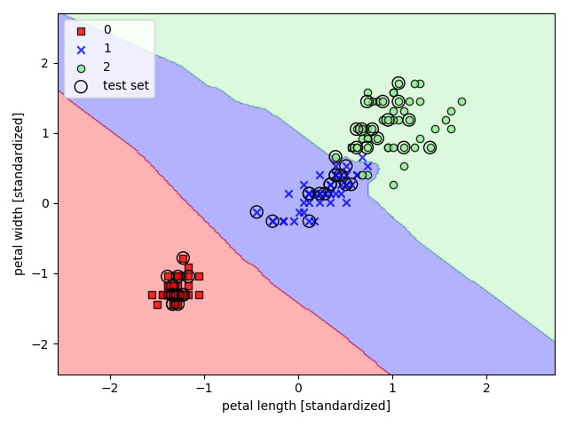

# KNN - K-Nearest neighbors
KNN is a typical example of a lazy learner. 
It is called "lazy" not because of its apparent simplicity, 
but because it doesn't learn a discriminative function from 
the training data but memorizes the training dataset instead

I used KNN on Iris flower dataset:

