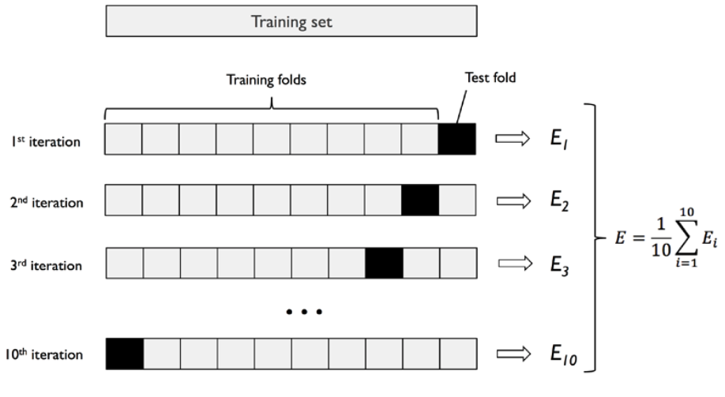
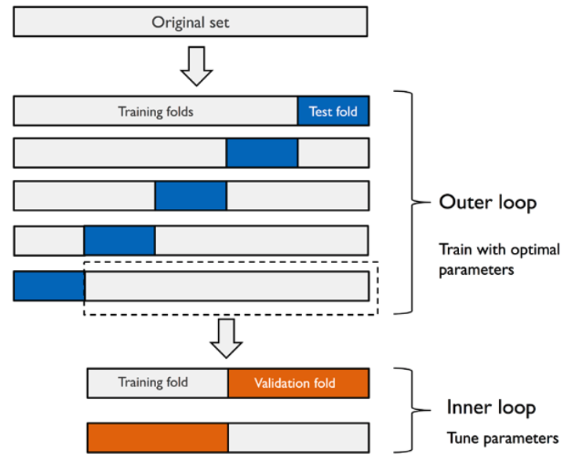
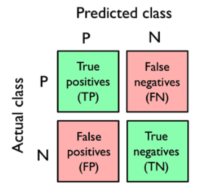

# MODEL EVALUATION & HYPERPARAMETER TUNIG

My code in this example is all based on Breast Cancer Wisconsin dataset.

Breast Cancer Wisconsin dataset, which contains 569 examples of malignant and benign tumor cells. 
The first two columns in the dataset store the unique ID numbers of the examples and the corresponding diagnoses 
(M = malignant, B = benign), respectively. Columns 3-32 contain 30 real-valued features that have been 
computed from digitized images of the cell nuclei, which can be used to build a 
model to predict whether a tumor is benign or malignant. 
The Breast Cancer Wisconsin dataset has been deposited in the UCI Machine Learning Repository, 
and more detailed information about this dataset can be found 
at https://archive.ics.uci.edu/ml/datasets/Breast+Cancer+Wisconsin+(Diagnostic)

### Pipeline

I worked with Pipeline -  fit a model including an arbitrary number of 
transformation steps and apply it to make predictions about new data

### holdout method

Split the dataste into 3 categories:

- Train dataset
- Validation dataset
- Test dataset

It is very good to have test data which hasn't been seen yet! Model will be good on predicting in real world on new data.

### K-fold cross-validation

In k-fold cross-validation, we randomly split the training dataset into k folds without replacement, where k – 1 folds are 
used for the model training, and one fold is used for performance evaluation. This procedure is repeated k 
times so that we obtain k models and performance estimates

-> then calculate average performace

-> after finding satisfactory hyperparameters values => retrain model on complete training dataset -> obtain final performance

-> advantage => each example will be used for training & for validation exactly once

### Grid search

it's a brute-force exhaustive search paradigm where we specify a list of values for different 
hyperparameters, and the computer evaluates the model performance for each combination 
to obtain the optimal combination of values from this set

### Nested cross-validation

### Confusion matrix

A confusion matrix is simply a square matrix that reports the counts of the true positive (TP), true negative (TN), 
false positive (FP), and false negative (FN) predictions of a classifier, as shown in the following figure

Both the prediction error (ERR) and accuracy (ACC) provide general information about how 
many examples are misclassified. The error can be understood as the sum of all false predictions 
divided by the number of total predictions, and the accuracy is calculated as the sum of correct 
predictions divided by the total number of predictions

### ROC AUC
Receiver operating characteristic (ROC) graphs are useful tools to select models for 
classification based on their performance with respect to the FPR and TPR, which are computed by shifting 
the decision threshold of the classifier. The diagonal of
a ROC graph can be interpreted as random guessing, and classification models that fall 
below the diagonal are considered as worse than random guessing. A perfect classifier would 
fall into the top-left corner of the graph with a TPR of 1 and an FPR of 0. Based on the ROC curve, 
we can then compute the so-called ROC area under the curve (ROC AUC) to characterize the performance 
of a classification model

### CLASS IMBALANCE

Imagine that the Breast Cancer Wisconsin dataset that we've been working with in this chapter 
consisted of 90 percent healthy patients. In this case, we could achieve 90 percent accuracy on the 
test dataset by just predicting the majority class (benign tumor) for all examples, without the 
help of a supervised machine learning algorithm. Thus, training a model on such a dataset that 
achieves approximately 90 percent test accuracy would mean our model hasn't learned anything useful 
from the features provided in this dataset.

SOLVE class imbalance:
- assign a larger penalty to wrong predictions on the minority class
- upsampling the minority class, downsampling the majority class
- generation of synthetic training examples
