## MACHINE LEARNING
I am coding examples from a book - Python Machine Learning third editin

# PERCEPTRON
Basic code for Perceptron from scratch.
This is how basic Perceptron looks like:

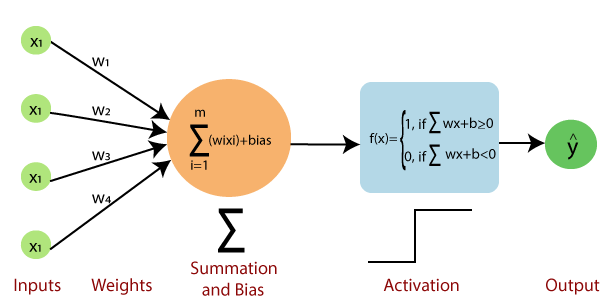

As a data I used IRIS dataset. I divide data based on labels 'setosa' amd 'cersicolor'.
Then perceptron learn - adjust his weights, to divide these 2 classes.

#### Result:

Perceptron with Scikit-learn library on Iris flower dataset:

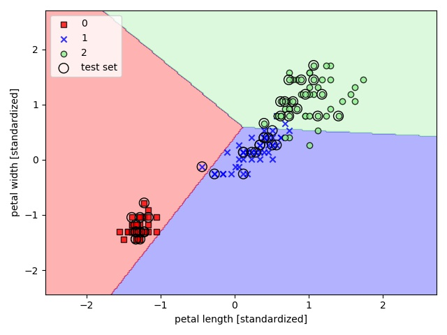 

# SVM

Powerful and widely used learning algorithm is the support vector machine (SVM), 
which can be considered an extension of the perceptron. Using the perceptron algorithm, 
we minimized misclassification errors. However, in SVMs our optimization objective is to maximize the margin. 
The margin is defined as the distance between the separating hyperplane (decision boundary) and the training examples 
that are closest to this hyperplane, which are the so-called support vectors. This is illustrated in the following figure:

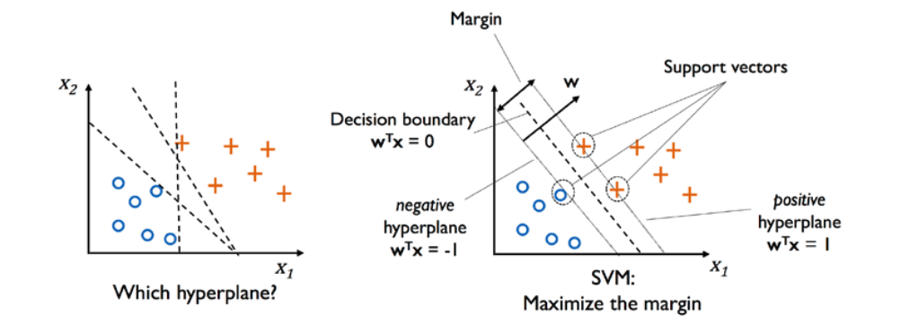 

#### Kernel trick

How to visualize and model non-linear data with SVM?

1 - transform it to higher dimension

2 - train linear SVM model to classify data in a new feature space

In my code, I tried it with this type of dataset and the result:

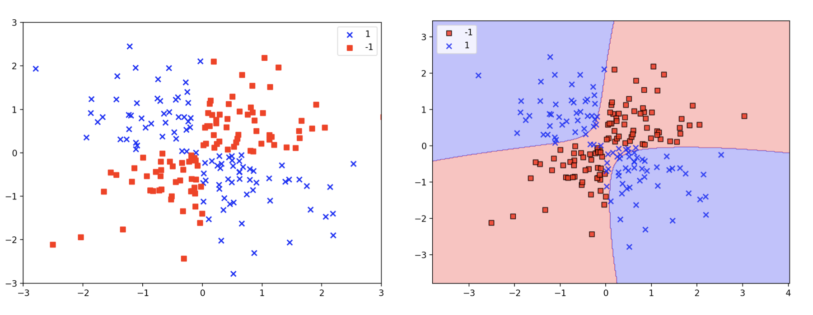

#### GAMMA - cut off parameter
Gamma is used to control overfitting.

svm = SVC(kernel='rbf', random_state=1, gamma=xxx, C=1.0)

Bigger gammga = possible overfitting

GAMMA = 0.2 | GAMMA = 100

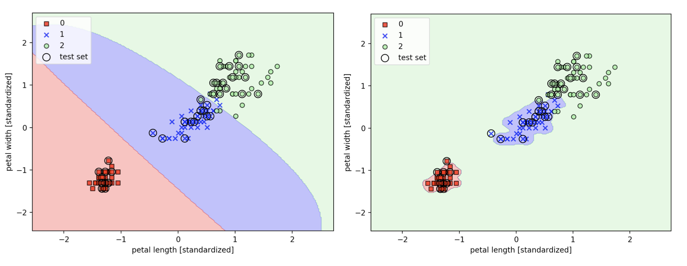

# DECISION TREE

A decision tree is a decision support tool that uses a tree-like model of decisions and their possible consequences, 
including chance event outcomes, resource costs, and utility. It is one way to display an algorithm that only 
contains conditional control statements.

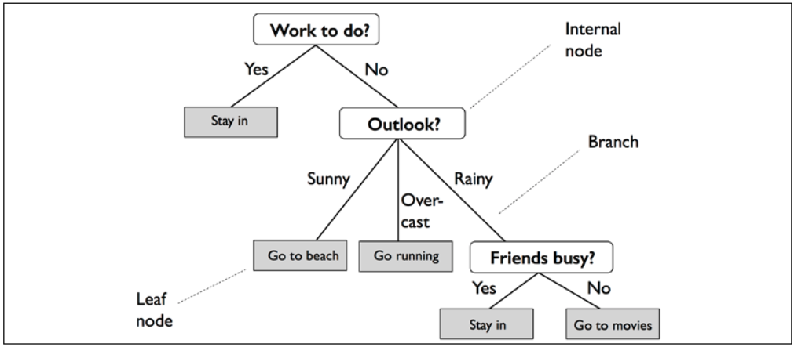

Decision trees are commonly used in operations research, specifically in decision analysis, 
to help identify a strategy most likely to reach a goal, but are also a popular tool in machine learning.

I used Decision Tree model on Iris flower dataset:

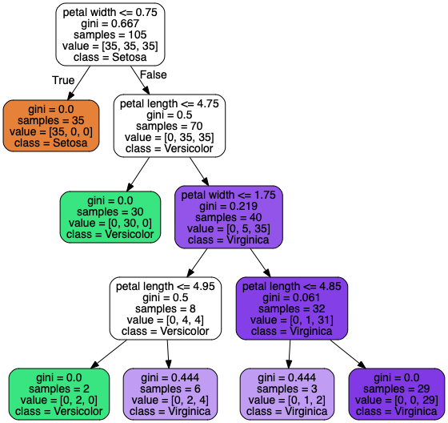

# RANDOM FOREST

Random forests are an ensemble learning method for classification, regression and other tasks that operate by constructing a multitude of decision trees at training time and outputting the class that is the mode of the classes (classification) or mean prediction (regression) of the individual trees. Random decision forests correct for decision trees' habit of overfitting to their training set.

Random forest of 25 decision trees:

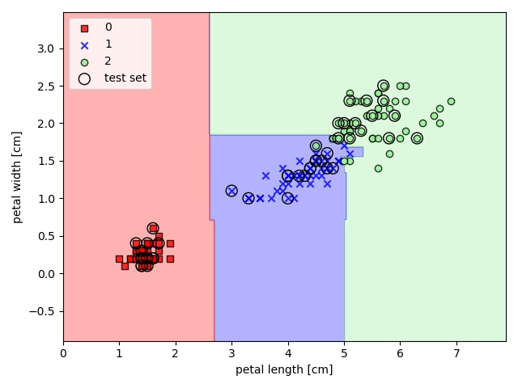

# KNN - K-Nearest neighbors
KNN is a typical example of a lazy learner. 
It is called "lazy" not because of its apparent simplicity, 
but because it doesn't learn a discriminative function from 
the training data but memorizes the training dataset instead

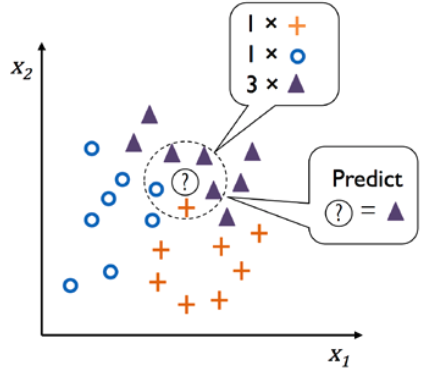

I used KNN on Iris flower dataset:

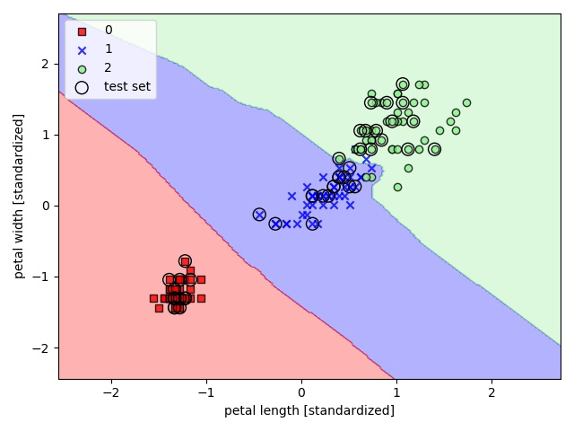

# DATA PRE-PROCESSING

The quality of the data and the amount of useful information that it contains are key factors 
that determine how well a machine learning algorithm can learn. 
Therefore, it is absolutely critical to ensure that we examine and preprocess a dataset 
before we feed it to a learning algorithm. In this file, 
I was working on the essential data preprocessing techniques that will help to build good machine learning models.

Main topics in data pre-processing:
- Removing and imputing missing values from the dataset
- Getting categorical data into shape for machine learning algorithms
- Selecting relevant features for the model construction

I was working with wine dataset. This is picture of Feature importance in that dataset, 
which can help in getting rid of some part of data in future - make dataset smaller.

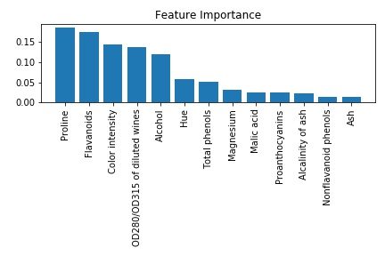

# COMPRESSING DATA via DIMENSIONALITY REDUCTION

I learned about three different, fundamental dimensionality reduction techniques 
for feature extraction: standard PCA, LDA, and KPCA. 

- Using PCA, I projected data onto a lower-dimensional subspace to maximize the variance along the orthogonal feature axes, 
while ignoring the class labels. 

- LDA, in contrast to PCA, is a technique for supervised dimensionality reduction, 
which means that it considers class information in the training dataset to attempt to maximize the 
class-separability in a linear feature space

- Lastly nonlinear feature extractor, KPCA. 
Using the kernel trick and a temporary projection into a higher-dimensional feature space, 
I was ultimately able to compress datasets consisting of nonlinear features onto a lower-dimensional 
subspace where the classes became linearly separable.

# MODEL EVALUATION & HYPERPARAMETER TUNIG

My code in this example is all based on Breast Cancer Wisconsin dataset.
(https://archive.ics.uci.edu/ml/datasets/Breast+Cancer+Wisconsin+(Diagnostic) )

#### Pipeline

I worked with Pipeline -  fit a model including an arbitrary number of 
transformation steps and apply it to make predictions about new data

#### holdout method

Split the dataste into 3 categories:

- Train dataset
- Validation dataset
- Test dataset

It is very good to have test data which hasn't been seen yet! Model will be good on predicting in real world on new data.

#### K-fold cross-validation

In k-fold cross-validation, we randomly split the training dataset into k folds without replacement, where k – 1 folds are 
used for the model training, and one fold is used for performance evaluation. This procedure is repeated k 
times so that we obtain k models and performance estimates

-> then calculate average performace

-> after finding satisfactory hyperparameters values => retrain model on complete training dataset -> obtain final performance

-> advantage => each example will be used for training & for validation exactly once

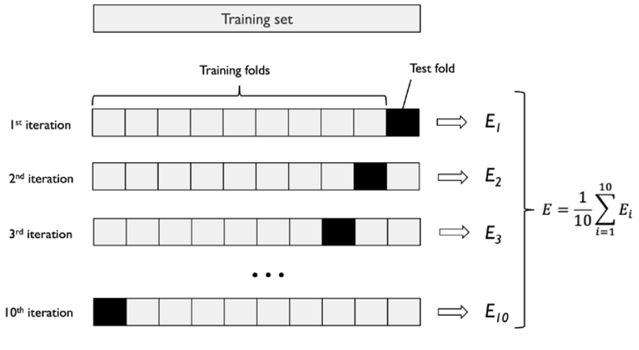

#### Grid search

it's a brute-force exhaustive search paradigm where we specify a list of values for different 
hyperparameters, and the computer evaluates the model performance for each combination 
to obtain the optimal combination of values from this set

#### Nested cross-validation

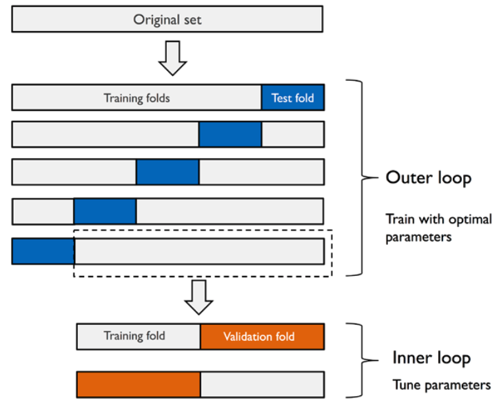

#### Confusion matrix

A confusion matrix is simply a square matrix that reports the counts of the true positive (TP), true negative (TN), 
false positive (FP), and false negative (FN) predictions of a classifier, as shown in the following figure

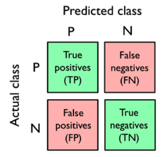

### ROC AUC
Receiver operating characteristic (ROC) graphs are useful tools to select models for 
classification based on their performance with respect to the FPR and TPR, which are computed by shifting 
the decision threshold of the classifier. The diagonal of
a ROC graph can be interpreted as random guessing, and classification models that fall 
below the diagonal are considered as worse than random guessing. A perfect classifier would 
fall into the top-left corner of the graph with a TPR of 1 and an FPR of 0. Based on the ROC curve, 
we can then compute the so-called ROC area under the curve (ROC AUC) to characterize the performance 
of a classification model

### CLASS IMBALANCE

When class1 has 80% and class2 has 20% of dataset

SOLVE class imbalance:
- assign a larger penalty to wrong predictions on the minority class
- upsampling the minority class, downsampling the majority class
- generation of synthetic training examples

# Learning with ensembles

The goal of ensemble methods is to combine different classifiers into a meta-classifier that has better 
generalization performance than each individual classifier alone. 

For example, assuming that we collected predictions from 10 experts, 
ensemble methods would allow us to strategically combine those predictions 
by the 10 experts to come up with a prediction that was more accurate and robust than 
the predictions by each individual expert.

### majority voting principle

select the class label that has been predicted by 
the majority of classifiers, that is, received more than 50 percent of the votes

Using the training dataset, we start by training m different classifiers (C1, ... , Cm). 
Depending on the technique, the ensemble can be built from different classification algorithms, 
for example, decision trees, support vector machines, logistic regression classifiers, and so on. 

### Train three different classifiers:
- Logistic regression classifier
- Decision tree classifier
- k-nearest neighbors classifier

Evaluate the model performance of each classifier via 10-fold cross-validation on the training dataset before 
combining them into an ensemble classifier

10-fold cross validation:

ROC AUC: 0.87 (+/- 0.17) [Logistic regression]

ROC AUC: 0.89 (+/- 0.16) [Decision tree]

ROC AUC: 0.88 (+/- 0.15) [KNN]

ROC AUC: 0.94 (+/- 0.13) [Majority voting]

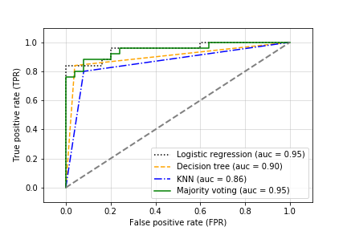

Interestingly, but also as expected, the decision regions of the ensemble classifier seem to be a hybrid of 
the decision regions from the individual classifiers. At first glance, the majority vote decision boundary 
looks a lot like the decision of the decision tree stump, which is orthogonal to the y axis for sepal width ≥ 1. However, 
you can also notice the non-linearity from the k-nearest neighbor classifier mixed in

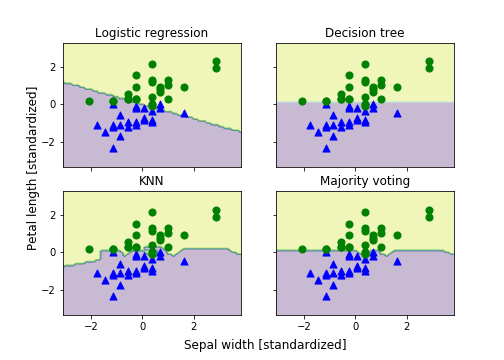

### Bagging – building an ensemble of classifiers from bootstrap samples

Bagging is an ensemble learning technique that is closely related to the MajorityVoteClassifier. However, 
instead of using the same training datas
et to fit the individual classifiers in the ensemble, we draw bootstrap 
samples (random samples with replacement) from the initial training dataset, which is why bagging is also known 
as bootstrap aggregating

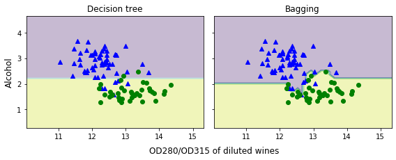

### Adaptive Boosting (AdaBoost)

In boosting, the ensemble consists of very simple base classifiers, 
also often referred to as weak learners, which often only have a slight 
performance advantage over random guessing a typical example of a weak learner is a decision tree stump. 

The key concept behind boosting is to focus on training examples that are hard
to classify, that is, to let the weak learners subsequently learn from 
misclassified training examples to improve the performance of the ensemble.

The following subsections will introduce the algorithmic procedure behind the 
general concept of boosting and AdaBoost. Lastly, we will use scikit-learn 
for a practical classification example.

### How boosting works
In contrast to bagging, the initial formulation of the boosting algorithm uses random subsets of training 
examples drawn from the training dataset without replacement; the original boosting procedure can be summarized in the following four key steps:
1. Draw a random subset of training examples, d1, without replacement from the training dataset, D, to train a weak learner, c1.
2. Draw a second random training subset, d2, without replacement from the training dataset and add 50 percent of 
the examples that were previously misclassified to train a weak learner, c2.
3. Find the training examples, d3, in the training dataset, D, which c1 and c2 disagree upon, to train a third weak learner, c3.
4. Combine the weak learners c1, c2, and c3 via majority voting.

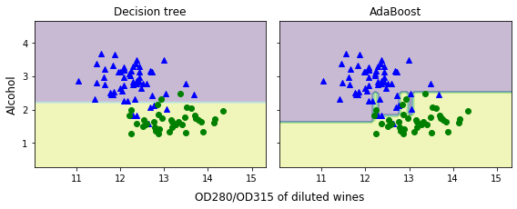

# Embedding a Machine Learning Model into a Web Application

In this chapter, I was working on embedding a machine learning model into
a web application that can not only classify, but also learn from data in real time. 
The topics that I worked on are as follows:

- Saving the current state of a trained machine learning model
- Using SQLite databases for data storage
- Developing a web application using the popular Flask web framework
- Deploying a machine learning application to a public web server

To sum it up:

I learned how to serialize a model after training and how to load it for later use cases. Furthermore, 
I created an SQLite database for efficient data storage and created a web application that lets
me make my movie classifier available to the outside world

http://raschkas.pythonanywhere.com

This is how it looks like after I wrote some basic movie review:

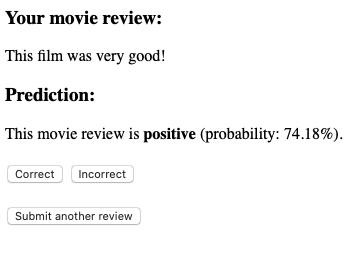

