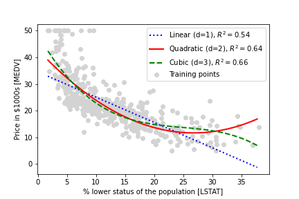

# Regression analysis

Regression models are used to predict target variables on a continuous scale, which makes 
them attractive for addressing many questions in science. They also have applications in industry, 
such as understanding relationships between variables, evaluating trends, or making forecasts. 

One example is predicting the sales of a company in future months.
In this chapter I worked on main concepts of regression models and cover the following topics:
- Exploring and visualizing datasets
- Looking at different approaches to implement linear regression models
- Training regression models that are robust to outliers
- Evaluating regression models and diagnosing common problems
- Fitting regression models to nonlinear data

In this Chapter I am working with Housing dataset which can be downloaded from - 

https://github.com/scikit-learn/scikit-learn/blob/master/sklearn/datasets/data/boston_house_prices.csv

#### SCATTER PLOT

#### CORRELATION MATRIX

## Linear Regression

The goal of linear regression is to model the relationship between 
one or multiple features and a continuous target variable. In contrast to 
classification—a different subcategory of supervised learning—regression analysis aims 
to predict outputs on a continuous scale rather than categorical class labels

### Simple linear regression

The goal of simple (univariate) linear regression is to model the 
relationship between a single feature (explanatory variable, x) and 
a continuous-valued target (response variable, y).

y = w0 + w1 * x 

(y = ax + b)

Goal is to learn the weights (w0, w1)

linear regression can be understood as finding the best-fitting straight line through the training examples
This best-fitting line is also called the regression line, and the vertical lines from the regression line to 
the training examples are the so-called offsets or residuals—the errors of our prediction

### RANSAC

As an alternative to throwing out outliers, we will look at a robust method of regression using the RANdom SAmple Consensus (RANSAC) algorithm, which fits a regression model to a subset of the data, the so-called inliers.

### Polynomial regression

y = w0 + w1x + w2x^2 + ..... + wdx^d

d denotes the degree of the polynomial

### Modeling nonlinear relationships in the Housing dataset

Cubic fit captures the relationship between house prices and LSTAT better than the linear and quadratic fit. However, you should be aware that adding more and more polynomial features increases the complexity of a model and therefore increases the chance of overfitting

### Multiple linear regression

y = w0x0 + w1x1 +... = wT x

### Dealing with nonlinear relationships using random forests

via the decision tree algorithm, we subdivide the input space into smaller regions that become more manageable
An advantage of the decision tree algorithm is that it does not require any transformation of the features if we are dealing with nonlinear data, because decision trees analyze one feature at a time, rather than taking weighted combinations into account

A random forest usually has a better generalization performance than an individual decision tree due to randomness, which helps to decrease the model's variance. Other advantages of random forests are that they are less sensitive to outliers in the dataset and don't require much parameter tuning.
The only parameter in random forests that we typically need to experiment with is the number of trees in the ensemble.

Unfortunately, there is not a universal approach for dealing with non-randomness in residual plots, and it requires experimentation. Depending on the data that is available to us, we may be able to improve the model by transforming variables, tuning the hyperparameters of the learning algorithm, choosing simpler or more complex models, removing outliers, or including additional variables
