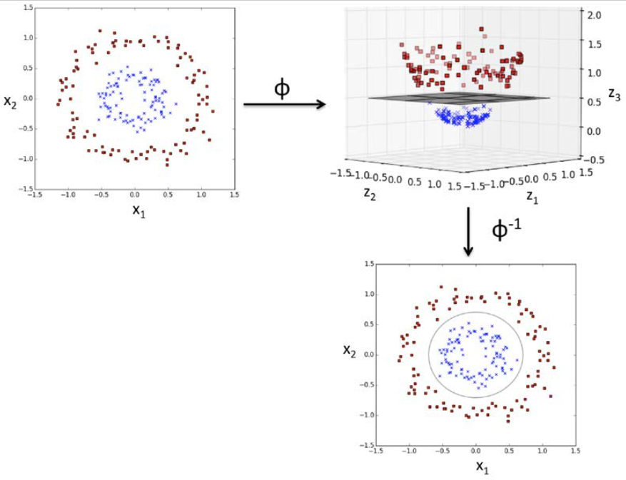

Powerful and widely used learning algorithm is the support vector machine (SVM), 
which can be considered an extension of the perceptron. Using the perceptron algorithm, 
we minimized misclassification errors. However, in SVMs our optimization objective is to maximize the margin. 
The margin is defined as the distance between the separating hyperplane (decision boundary) and the training examples 
that are closest to this hyperplane, which are the so-called support vectors. This is illustrated in the following figure:

 

### result on Iris flower dataset

## KERNEL TRICK
How to visualize and model non-linear data with SVM?

1 - transform it to higher dimension

2 - train linear SVM model to classify data in a new feature space

In my code, I tried it with this type of dataset:

and the result is here:

## GAMMA - cut off parameter
Gamma is used to control overfitting.

svm = SVC(kernel='rbf', random_state=1, gamma=xxx, C=1.0)

Bigger gammga = possible overfitting

GAMMA = 0.2 | GAMMA = 100

