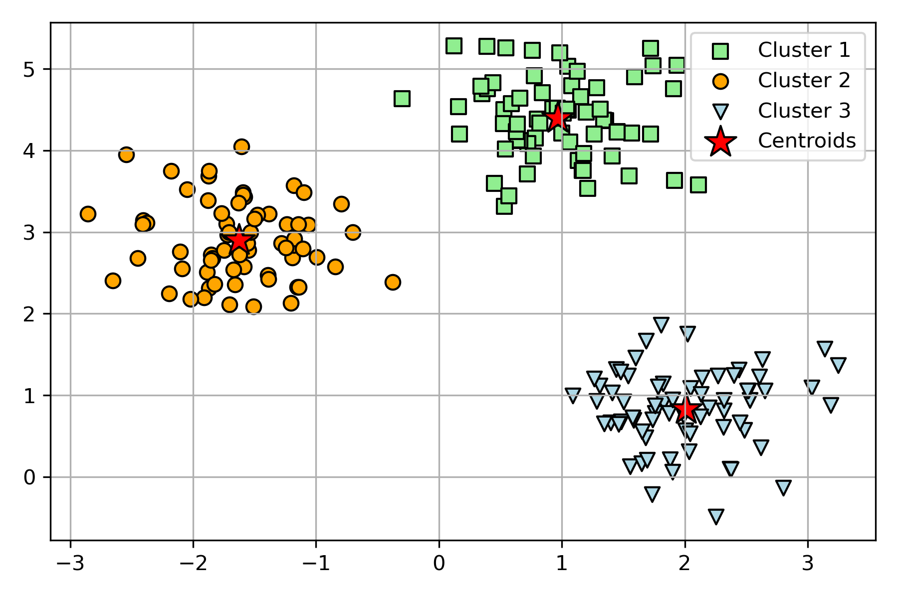
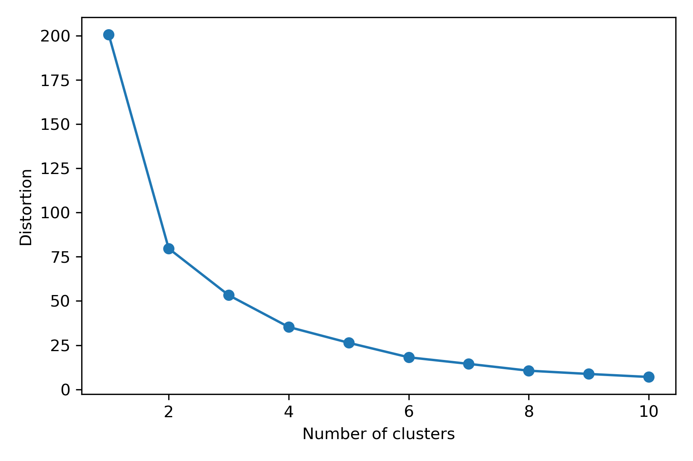
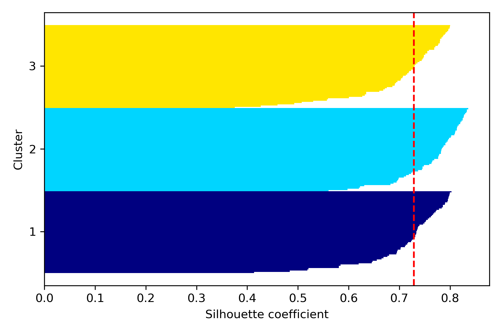
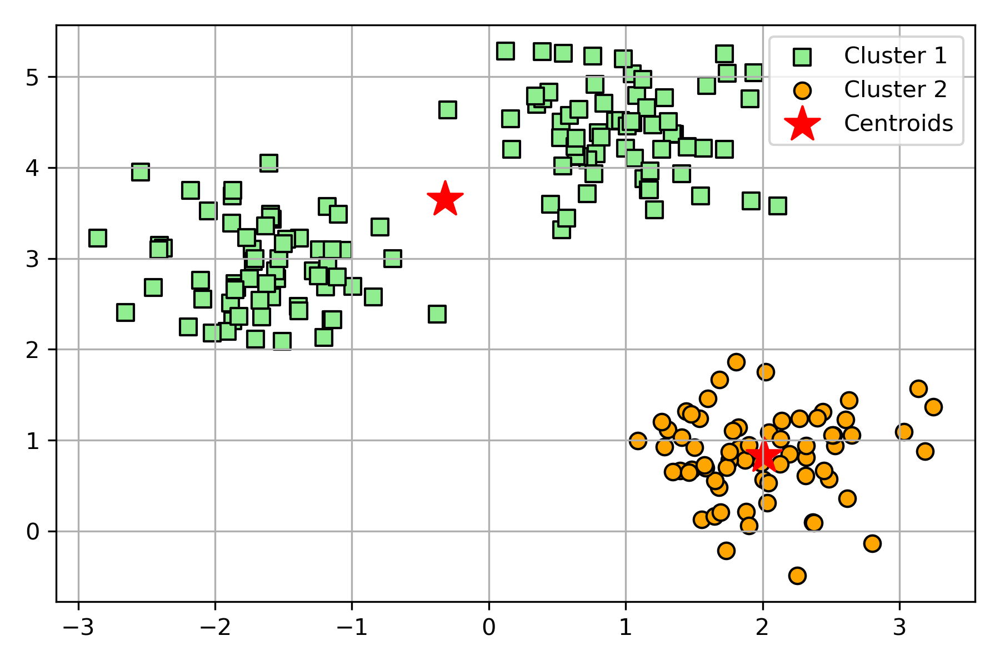
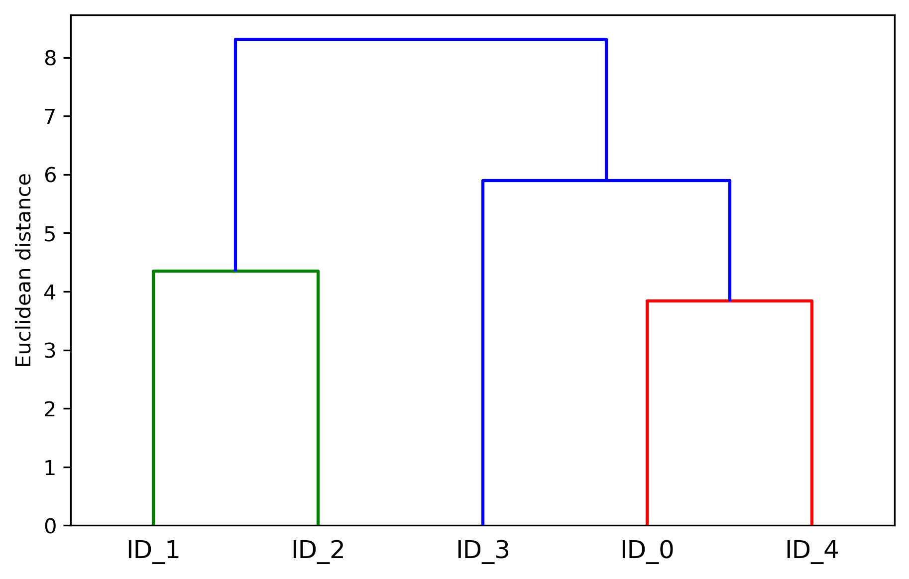
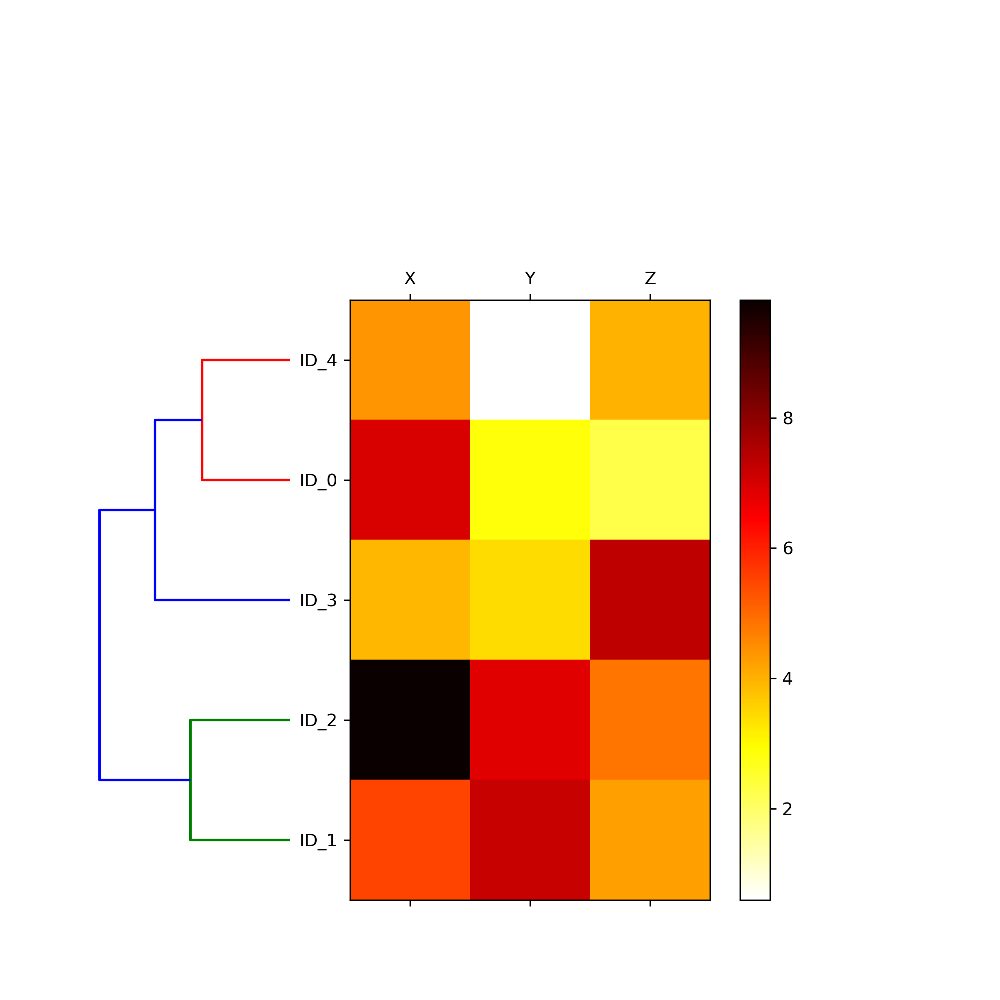
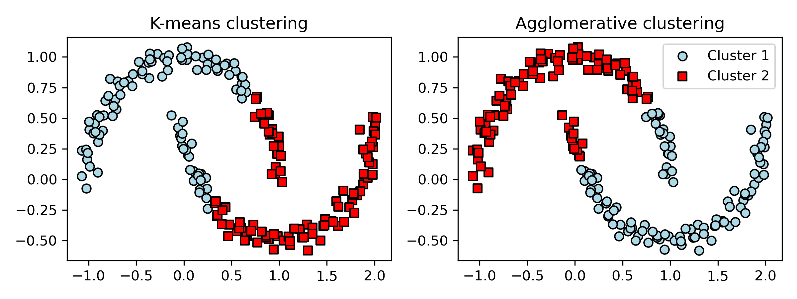
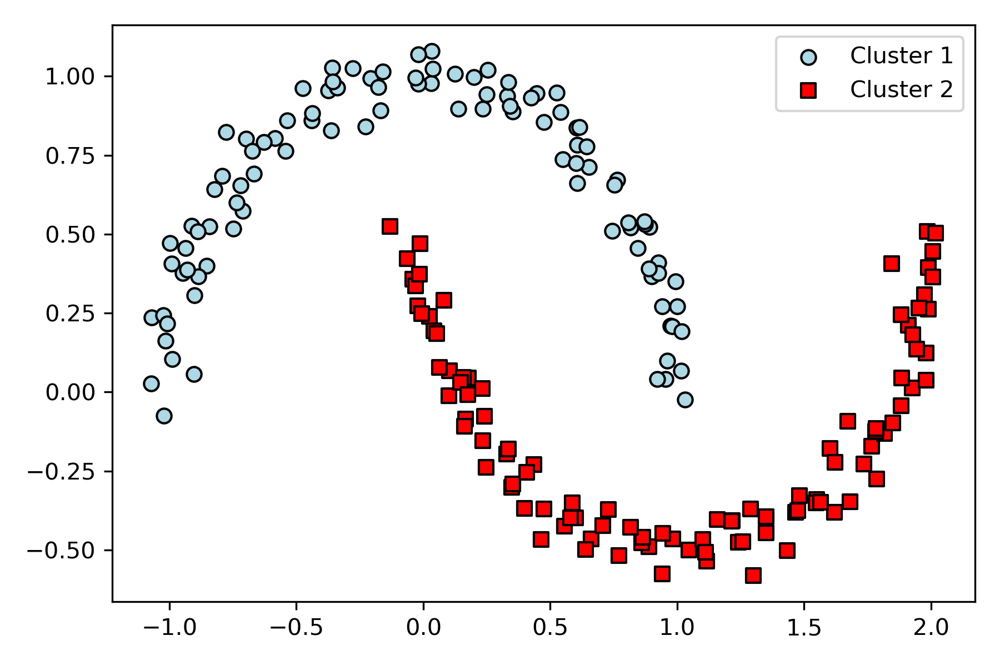

# Working with Unlabeled Data – Clustering Analysis

In the previous chapters, we used supervised learning techniques to build machine 
learning models, using data where the answer was already known—the class labels
 were already available in our training data. In this chapter, we will switch 
 gears and explore cluster analysis, a category of unsupervised learning 
 techniques that allows us to discover hidden structures in data where we do not 
 know the right answer upfront. The goal of clustering is to find a natural grouping 
 in data so that items in the same cluster are more similar to each other than to those 
 from different clusters.

# K - means clustering

Clustering (or cluster analysis) is a technique that allows us to 
find groups of similar objects that are more related to each other than 
to objects in other groups.

Grouping of documents, music, and movies by different topics, or finding 
customers that share similar interests based on common purchase behaviors 
as a basis for recommendation engines

## prototype-based clustering

each cluster is represented by a prototype, which is usually either:

- the centroid (average) of similar points with continuous features
- or the medoid (the most representative or the point that minimizes 
the distance to all other points that belong to a particular cluster) 
in the case of categorical features

While k-means is very good at identifying clusters with a spherical shape

one of the drawbacks of this clustering algorithm is that we have to 
specify the number of clusters - k

choice for k can result in poor clustering performance

k-means clustering can be applied to data in higher dimensions

# k-means++

So far, we have discussed the classic k-means algorithm, which uses a random 
seed to place the initial centroids, which can sometimes result in bad clusterings 
or slow convergence if the initial centroids are chosen poorly. One way to address 
this issue is to run the k-means algorithm multiple times on a dataset and choose 
the best performing model in terms of the SSE

Another strategy is to place the initial centroids far away from each other via the 
k-means++ algorithm, which leads to better and more consistent results than the 
classic k-means

As you can see in the following plot, the elbow is located at k = 3, so this is evidence 
that k = 3 is indeed a good choice for this dataset:

## Quantifying the quality of clustering via silhouette plots

Silhouette analysis can be used as a graphical tool to plot a measure of how tightly 
grouped the examples in the clusters are

The silhouette coefficient is available as silhouette_samples from scikit-learn's 
metric module, and optionally, the silhouette_scores function can be imported for 
convenience. The silhouette_scores function calculates the average silhouette 
coefficient across all examples, which is equivalent to 
numpy.mean(silhouette_samples(...)). By executing the following code, we will
now create a plot of the silhouette coefficients for a k-means clustering with k = 3:

## comparision to bad clustering - k-means with only 2 centroids

# Organizing clusters as a hierarchical tree

Advantage of the hierarchical clustering algorithm is that it allows us to plot 
dendrograms (visualizations of a binary hierarchical clustering), which can help 
with the interpretation of the results by creating meaningful taxonomies. Another 
advantage of this hierarchical approach is that we do not need to specify the number 
of clusters upfront.

The two main approaches to hierarchical clustering are agglomerative and 
divisive hierarchical clustering.

DIVISIVE clustering

Start with one cluster that encompasses the complete dataset, 
and iteratively split the cluster into smaller clusters until each 
cluster only contains one example.

AGGLOMERATIVE clustering

Takes the opposite approach. Start with each example as an individual 
cluster and merge the closest pairs of clusters until only one cluster remains.

- single linkage - compute the distances between the most similar members for 
each pair of clusters and merge the two clusters for which the distance between 
the most similar members is the smallest

- complete linkage - similar to single linkage but, instead of comparing the most 
similar members in each pair of clusters, we compare the most dissimilar members to 
perform the merge

### Attaching dendrograms to a heat map

In practical applications, hierarchical clustering dendrograms are often used in 
combination with a heat map, which allows us to represent the individual values in 
the data array or matrix containing our training examples with a color code.

# Applying agglomerative clustering via scikit- learn

# DBSCAN - density based clustering

It is important to emphasize that a successful clustering does not only depend 
on the algorithm and its hyperparameters; rather, the choice of an appropriate 
distance metric and the use of domain knowledge that can help to guide the experimental 
setup can be even more important

# Summary

- K-means - clusters examples into spherical shapes based on a specified number 
of cluster centroids. Since clustering is an unsupervised method, we do not enjoy 
the luxury of ground truth labels to evaluate the performance of a model. Thus, we 
used intrinsic performance metrics, such as the elbow method or silhouette analysis, 
as an attempt to quantify the quality of clustering.

- We then looked at a different approach to clustering: agglomerative hierarchical 
clustering. Hierarchical clustering does not require specifying the number of clusters 
upfront, and the result can be visualized in a dendrogram representation, which can 
help with the interpretation of the results.

- The last clustering algorithm that we covered in this chapter was DBSCAN, an 
algorithm that groups points based on local densities and is capable of handling 
outliers and identifying non-globular shapes.

