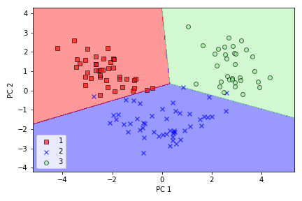
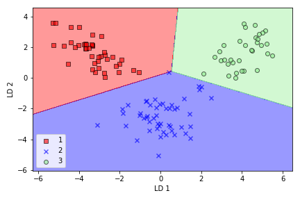

# COMPRESSING DATA via DIMENSIONALITY REDUCTION

I learned about three different, fundamental dimensionality reduction techniques 
for feature extraction: standard PCA, LDA, and KPCA. 

- Using PCA, I projected data onto a lower-dimensional subspace to maximize the variance along the orthogonal feature axes, 
while ignoring the class labels. 

- LDA, in contrast to PCA, is a technique for supervised dimensionality reduction, 
which means that it considers class information in the training dataset to attempt to maximize the 
class-separability in a linear feature space

- Lastly nonlinear feature extractor, KPCA. 
Using the kernel trick and a temporary projection into a higher-dimensional feature space, 
I was ultimately able to compress datasets consisting of nonlinear features onto a lower-dimensional 
subspace where the classes became linearly separable.
