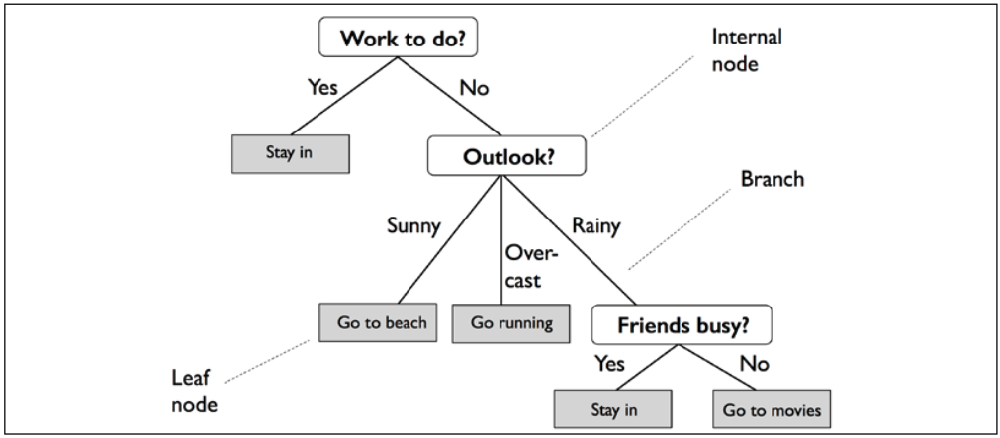

# DECISION TREE

A decision tree is a decision support tool that uses a tree-like model of decisions and their possible consequences, 
including chance event outcomes, resource costs, and utility. It is one way to display an algorithm that only 
contains conditional control statements.

Decision trees are commonly used in operations research, specifically in decision analysis, 
to help identify a strategy most likely to reach a goal, but are also a popular tool in machine learning.

I used Decision Tree model on Iris flower dataset:

# RANDOM FOREST

Random forests are an ensemble learning method for classification, regression and other tasks that operate by constructing a multitude of decision trees at training time and outputting the class that is the mode of the classes (classification) or mean prediction (regression) of the individual trees. Random decision forests correct for decision trees' habit of overfitting to their training set.

Random forest of 25 decision trees:

