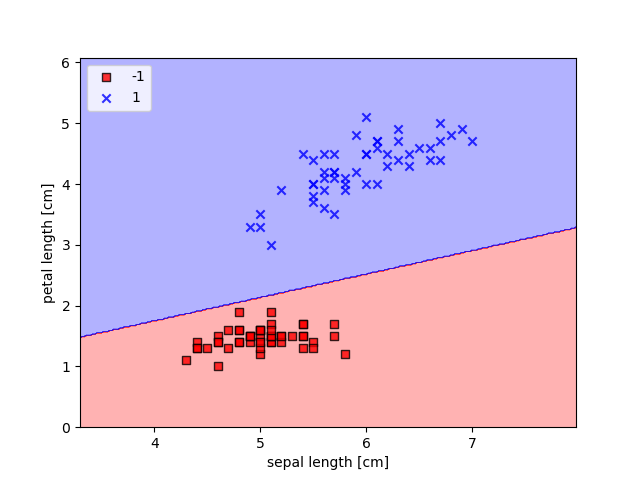

## PERCEPTRON
Basic code for Perceptron from scratch.
This is how basic Perceptron looks like:

As a data I used IRIS dataset. I divide data based on labels 'setosa' amd 'cersicolor'.
Then perceptron learn - adjust his weights, to divide these 2 classes.

#### Result:

